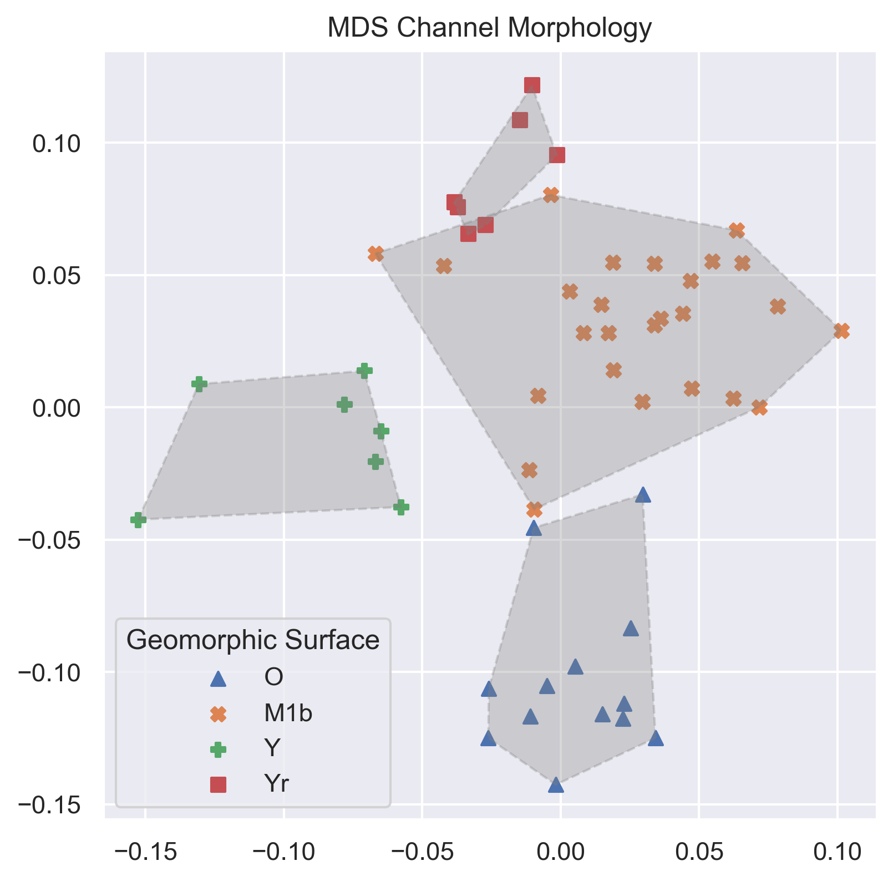
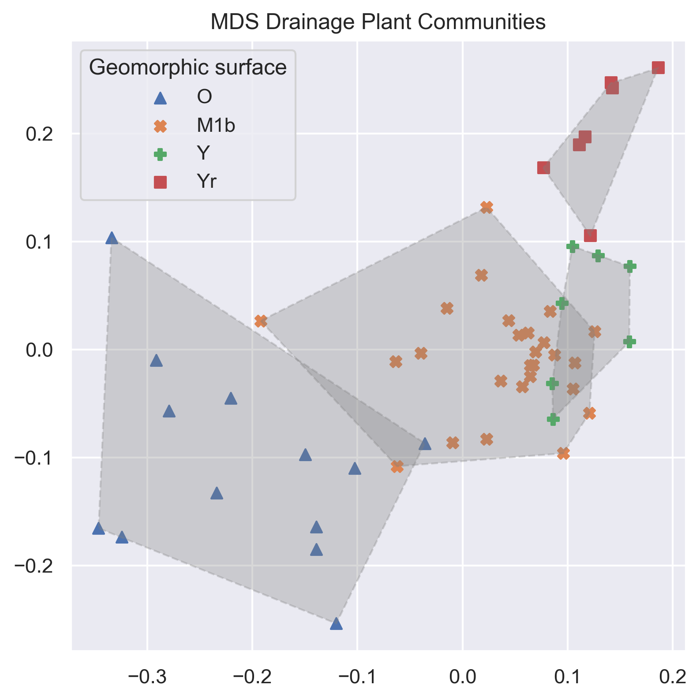

# Ephemeral-drainages
Analysis of Sonoran Desert ephemeral drainage geomorphology and plant communities.

This study analyzed the geomorphology of an ephemeral drainage and its associated plant communities in the White Tank Mountains, west of Phoenix, Arizona, in the Sonoran Desert. Plant distributions within the drainage and adjacent uplands were surveyed across a bajada composed of four geomorphic surfaces. Geomorphic surface variation explained the largest proportion of variation in both channel morphology and plant community composition. Non-metric multidimensional scaling (NMDS stress = 0.055) identified four distinct channel morphology types, which were validated with pairwise PERMANOVA (p < 0.005). Plant species richness decreased with distance from the mountain in both upland (𝑅^2=0.61) and drainage (𝑅^2=0.77) communities, with drainage sites containing on average 5.3 more species per paired location (permutation test, p < 0.001). NMDS further identified four distinct drainage plant communities associated with the four geomorphic surfaces (NMDS stress = 0.095, PERMANOVA p < 0.05) and three upland communities associated with the same surfaces (NMDS stress = 0.063, PERMANOVA p < 0.05). Finally, upland and drainage plant communities were found to be distinct (NMDS stress = 0.095, Bray–Curtis distance, PERMANOVA p < 0.05).  Overall, geomorphic surfaces were found to be the primary driver linking channel morphology with plant community compositions and species richness across both ephemeral drainage and upland environments. 

 
    <em>Multidimensional scaling ordination with Bray-Curtis dissimilarity measure identified four channel morphology categories determined by geomorphic surface (0.055 MDS stress, PERMANOVA p-value < 0.005 with Bray-Curtis pairwise distance). </em>

 
    

 
    <em>Regression of upland and drainage species richness with distance from mountain. Both plant communities have decreasing species richness with distance from the mountain (upland R^2 = 0.61, drainage R^2 = 0.77).  Drainage plant communities were found to have greater species richness along the bajada (paired differences permutation test p-value < 0.001).</em>

  
    

 
    <em>Multidimensional scaling ordination with Bray-Curtis dissimilarity measure identified four plant communities sperated by channel morphology or geomorphic surface types (0.095 MDS stress, PERMANOVA p-value < 0.05 with Bray-Curtis pairwise distance). </em>

  
    

 
    <em>Multidimensional scaling ordination with Bray-Curtis dissimilarity measure identified three plant communities sperated by geomorphic surface (0.063 MDS stress, PERMANOVA p-value < 0.05 with Bray-Curtis pairwise distance). </em>

    
    

 
    <em>Multidimensional scaling ordination with Bray-Curtis dissimilarity measure identified upland and drainage communities as distinct (0.095 MDS stress, PERMANOVA p-value < 0.05 with Bray-Curtis pairwise distance). </em>

    
    
    