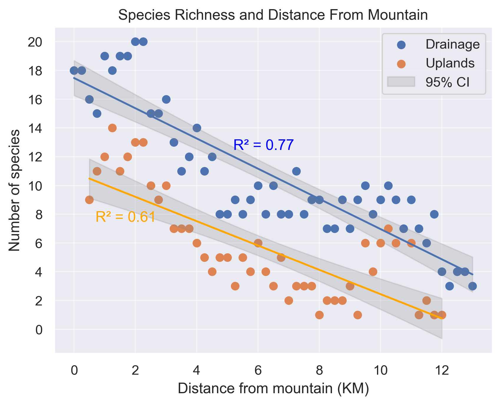

# Ephemeral-drainages
Analysis of Sonoran Desert ephemeral drainage geomorphology and plant communities.

This study analyzed the geomorphology of an ephemeral drainage and its associated plant communities in the White Tank Mountains, located west of Phoenix, Arizona, in the Sonoran Desert. Distributions of plants and plant communities both within the drainage and in the adjacent uplands were examined and analyzed. The drainage originated in a canyon on the west side of the range, extended downslope across a bajada composed of four distinct geomorphic surfaces, and terminated at its base in the Hassayampa River, a larger regional ephemeral drainage. Variation in geomorphic surfaces across the bajada emerged as the strongest factor explaining both channel morphology and plant community composition in the drainage and adjacent uplands. Using non-metric multidimensional scaling (NMDS) four distinct channel morphology types were identified (MDS stress 0.030), which were further validated through pairwise PERMANOVA comparisons (p < 0.005).  Ephemeral drainage and upland plant community species richness were found to decrease in parallel with distance from the mountain (upland $R^2 = 0.61, drainage $R^2 = 0.77) with drainage communities having statistically more species (permutation test p-value < 0.001).  

 
    <em>Multidimensional scaling ordination with Bray-Curtis dissimilarity measure identified four channel morphology categories determined by geomorphic surface (0.030 MDS stress, PERMANOVA p-value < 0.005 with Bray-Curtis pairwise distance). </em>

 
    <em>Regression of upland and drainage species richness with distance from mountain. Both plant communities have decreasing species richness with distance from the mountain (upland $R^2 = 0.61, drainage $R^2 = 0.77).  Drainage plant communities were found to have greater species richness along the bajada (paired differences permutation test p-value < 0.001).</em>

    
    